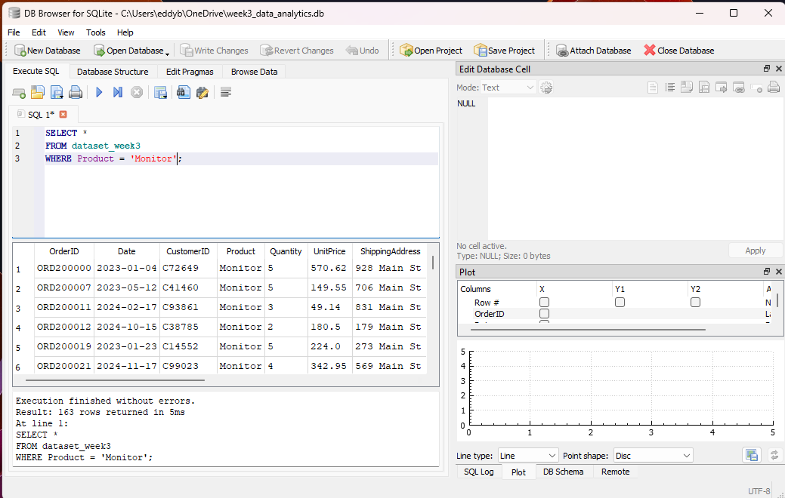
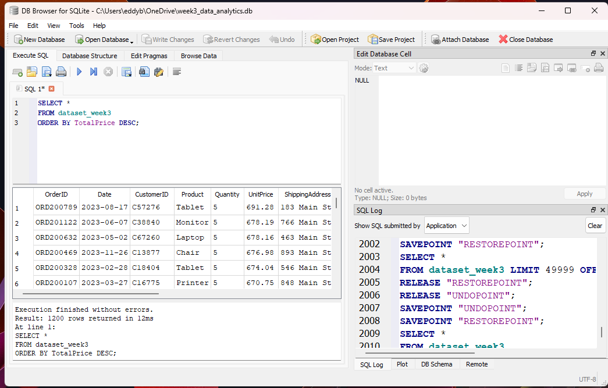
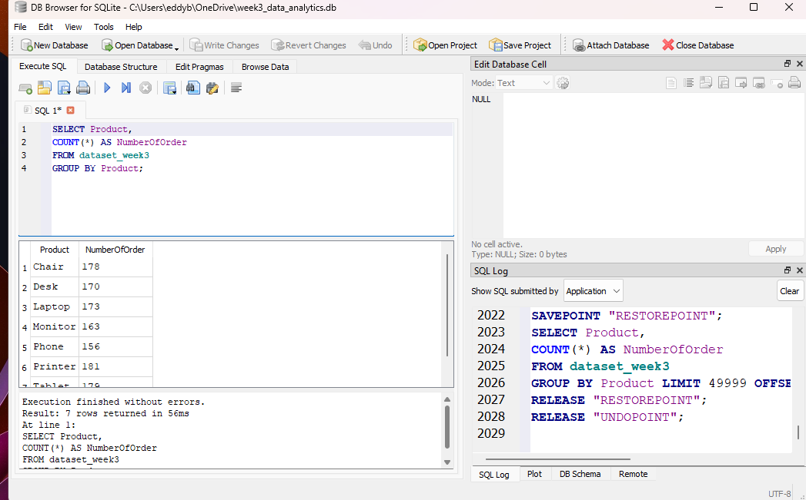
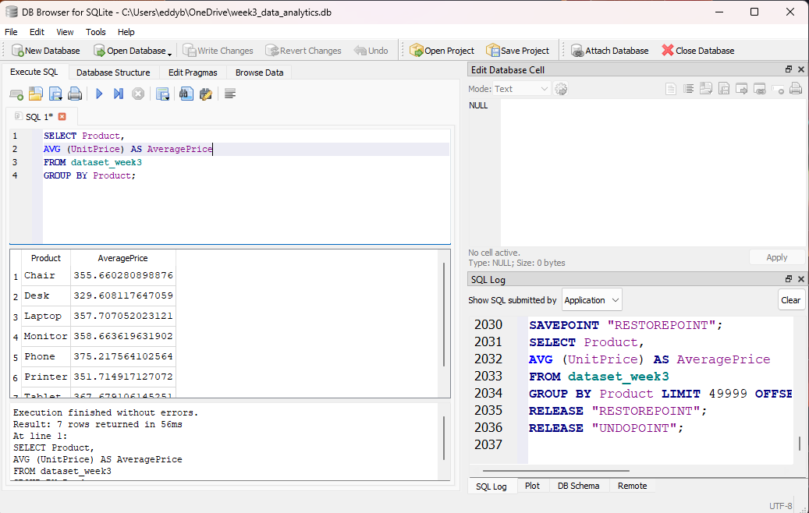
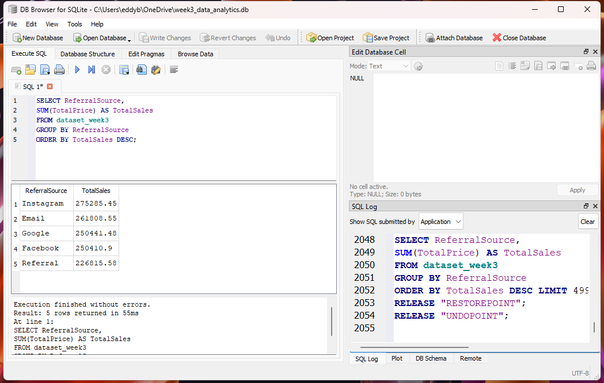

# DecodeLabs Week 3 - SQL Data Analysis Project

## Project Overview

This project was completed as part of the DecodeLabs Data Science Internship Program.

The objective of this project was to analyze data using SQL queries and relational database concepts. The project demonstrates how SQL can be used to retrieve, filter, sort, group, and summarize data to generate meaningful business insights.

## Dataset Summary

The project uses a structured dataset stored in both CSV and SQLite database formats. SQL queries were performed to explore the data, identify trends, and generate analytical results.

## Objectives

* Query data using SQL
* Filter records using WHERE clauses
* Sort results using ORDER BY
* Group data using GROUP BY
* Calculate aggregate values using COUNT, AVG, and SUM
* Generate insights from structured datasets

## Tools Used

* SQL
* SQLite
* DB Browser for SQLite
* CSV Dataset
* Database Analytics

## Technologies

* SQL
* SQLite
* Relational Databases
* Data Analysis
* Database Management

## Project Files

* dataset_week3.csv
* week3_data_analytics.db
* sql_where_clause.png
* sql_order_by.png
* sql_group_by_count.png
* sql_avg_function.png
* sql_sum_function.png

## Skills Demonstrated

* SQL Query Writing
* Database Analysis
* Data Retrieval
* Data Aggregation
* Data Filtering
* Relational Database Management
* Problem Solving

## SQL Queries Demonstrated

### WHERE Clause

### ORDER BY

### GROUP BY and COUNT

### AVG Function

### SUM Function

## Results

The project successfully demonstrated key SQL concepts used in real-world data analysis.

Key outcomes included:

* Filtering records using WHERE clauses
* Sorting data using ORDER BY
* Grouping records using GROUP BY
* Calculating summary statistics using COUNT, AVG, and SUM
* Generating insights from structured datasets

## What I Learned

Through this project, I strengthened my SQL and database analysis skills by working with structured datasets and performing analytical queries. I learned how to retrieve, organize, summarize, and analyze data using SQL techniques commonly used by data analysts and database professionals.

## Author

**Eddy Bartolome**

* GitHub: https://github.com/Edbart123
* DecodeLabs Data Science Internship Program
